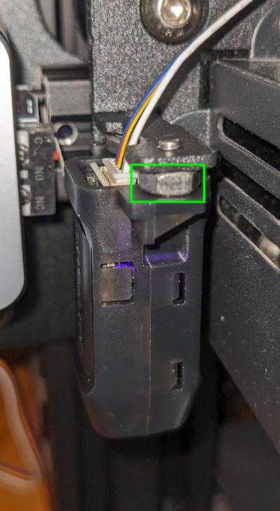
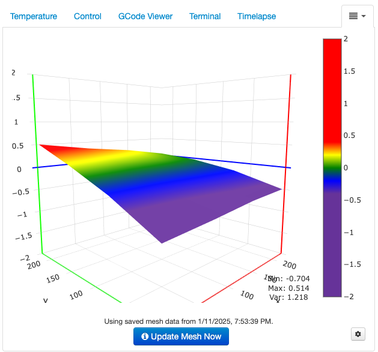

# CAD software

I started out with [FreeCAD](https://www.freecadweb.org/). I was impressed by the range of capabilities 
that comes with the software and the quality with which they are delivered---at least initially. Everything worked well 
for small parts and the initial phases of the larger arm project. However, as the design grew, the tree-structure 
representation of design elements became unwieldy. It was difficult to predict how the tree would rearrange following
an operation. Ultimately, a bug surfaced in the FreeCAD software, and I was unable to undo and recover my design. I 
started looking elsewhere and found [Autodesk Fusion 360](https://www.autodesk.com/products/fusion-360/personal), which 
can be obtained free of charge for personal use. I was, and still am, quite new to CAD; however, Fusion 360 is obviously 
a top-notch product. Everything just works. The operations are stunningly intuitive and well-crafted. It is difficult to 
imagine a reason for looking elsewhere except, of course, for the facts that the free version cannot be used 
commercially and the commercial version is quite expensive.

The small deboss labels on various components contain the Fusion 360 version numbers of the design file. This is a 
handy way to keep track of the design file version used to print each component, particularly when diagnosing issues, 
updating the design, and printing new versions. I use the 
[ParametricText](https://parametrictext.readthedocs.io/en/stable/) add-in to automatically update the version numbers 
when saving the design file.

# Mesh Slicer

[UltiMaker Cura](https://ultimaker.com/software/ultimaker-cura) is a simple tool with a single purpose:
slice the mesh outputs of a mesh model into horizontal layers of 3D printer instructions. I used Cura successfully for 
quite a while, but eventually ran into issues with filament stringing. After trying many (many) alternative 
configurations, I found that the [PrusaSlicer](https://www.prusa3d.com/) default settings are very effective, and I've
been using this tool ever since.

# 3D Printer

With endless options on the market it can be difficult to choose; however, at under $200 (in 2022) with generally 
quite positive reviews, it was difficult to get past the [Creality Ender 3](https://www.creality.com/products/ender-3-3d-printer). It was simple to assemble and has been 
cranking out high-quality pieces since the start.

## Web Interface

I use [OctoPrint](https://octoprint.org) with my Raspberry Pi as an efficient and easy way to manage print jobs. 
See [here](https://matthewgerber.github.io/raspberry-py/octoprint.html) for tips on configuring OctoPrint on the Pi.

## Automatic Bed Leveling

I added the [CR Touch Automatic Leveling Kit](https://www.amazon.com/Creality-Leveling-Compatible-Mainboard-Printer/dp/B098LQ9WPX/ref=sr_1_3?th=1) 
to my Ender 3. The sensor comes with a mounting bracket for the Ender 3; however, it isn't truly designed for this 
model, and I had previously replaced the hot end with [something different](https://www.amazon.com/Authentic-Creality-Assembled-Aluminum-Hotend/dp/B082XXRT78/ref=sr_1_2_sspa).
As a result, the sensor was mounted too far above the bed, which caused the hot end to drop down into the bed. After 
much experimenting and searching, I found that the sensor needed to be offset down toward the bed in order for 
everything to work. I did this by adding spacers as shown below:



After installing the hardware, flash the printer with the correct firmware [here](https://www.creality.com/products/cr-touch-auto-leveling-kit).
Download the firmware bundle prefixed with the printer name (e.g., "Ender-3 CR Touch Firmware" for an Ender 3 printer, or 
"Ender-3 V2 CR Touch Firmware" for an Ender 3 V2 printer). Within the bundle, select the board version. Note that 4.2.2 is 
an early board that requires a special adapter to plug the bed leveling probe into, whereas the 4.2.7 board has a direct 
connection for the probe. Clear an SD card and place the firmware binary onto the card as the only file. Name the file 
"firmware.bin", insert the SD card, and turn the printer off/on. The display should indicate that the firmware has been 
updated. Sometimes this is finicky, and the board doesn't take the firmware. Renaming the file "firmware-123.bin" or 
"Ender 3 firmware.bin" might work. The steps for calibrating the leveling probe's z-offset are as follows:

1. Auto-home the printer.
2. Move the z-axis to identify the appropriate z-offset using a sheet of A4 paper for thickness. Note the z-offset 
   that causes the nozzle to just slightly grab the paper. Call this `adjustment`.
3. Auto-home the printer again.
4. Access the leveling probe's z-offset and note its value. Call this `current`. Then set the leveling probe's 
   z-offset to `current + adjustment`.
5. Save the configuration settings.
6. Level the bed. The hot end should be in the correct position above the bed, with the z-value showing 0.0 on the 
   printer display and a very small gap between the nozzle and bed.
7. Add `G28 G29` to your slicer's g-code preamble. The `G28` (home) command is probably already present, in which case
   you just tack on `G29` (level bed).
8. Octoprint has a [bed leveling visualizer plugin](https://plugins.octoprint.org/plugins/bedlevelvisualizer), which displays the bed mesh as shown below:
  
9. Add `G28 G29` to your slicer's g-code preamble. The `G28` (home) command is probably already present, in which case
  you just tack on `G29` (level bed).

## Extruder-Step Calibration

After installing the new bed leveling firmware above, I kept running into under-extrusion issues. It took a while to 
realize that the new firmware was configured with a lower extrusion rate than the stock Ender 3 firmware. The process 
for calibrating the extrusion rate (or e-steps) is as follows:

1. Use the menu options to manually extrude 10cm (100mm) of filament. Here, 100mm is `expected mm`.
2. Measure how many mm of filament is actually extruded, and call this `actual mm`. If `actual mm` equals 
   `expected mm` exactly, then there is no need to calibrate the e-steps. If `actual mm` does not equal `expected mm`, 
   then proceed.
3. View the extruder's current `steps/mm` value. This is the number of steps that the printer expects it takes to 
   extrude 1mm of filament. Multiply `steps/mm * expected mm` to obtain `steps taken`, the number of steps the 
   extruder actually took to extrude `actual mm`. 
4. Calculate `steps taken / actual mm` to obtain the calibrated steps/mm value. Enter this into the settings. For
   example:
     1. Under-extrusion:  (81 steps/mm * 100mm expected) / (93mm actual) = 87.097 steps/mm calibrated
     2. Over-extrusion:  (81 steps/mm * 100mm expected) / (117mm actual) = 69.231 steps/mm calibrated
5. Python function to obtain the calibrated steps/mm:
   ```python
   def calibrate(
       expected_mm: float, 
       actual_mm: float, 
       steps_per_mm: float
   ) -> float: 
       return (steps_per_mm * expected_mm) / actual_mm
   ```
   
## Bed Update with Direct-drive Extrusion 
In the end, the automatic bed leveling update did not work very well. Some prints did okay, but others had issues when 
printing over the entire print bed. I ended up reverting back to the stock Ender 3 firmware as follows:

1. Visit the Creality Cloud [firmware site](https://www.crealitycloud.com/downloads/firmware/ender-series/ender-3)
2. Download `Ender-3Marlin2.0.6HW4.2.2 GD Version firmware`, as my Ender 3 has the 4.2.2 mainboard with the GD chip.
3. After flashing the firmware, the default language is Chinese. The language menu is second from bottom in the main
   interface.
4. Recalibrate the extrusion stepper motor (see above).

I updated to [a glass bed](https://www.amazon.com/Creality-Ender-Glass-Upgraded-235x235x4mm/dp/B07RD6D2ZQ/), which is
very flat, and also to [a direct-drive](https://www.amazon.com/dp/B09KG8MMQ2) adapter for the extrusion motor. This
has been working well.

## Changing the Bowden Tube and Nozzle

This is particularly relevant when the extruder stepper motor is skipping, the extruder gear is slipping on the 
filament, or the printer is under-extruding.
1. Remove the nozzle:  The flat end should be clean without any filament sitting on top, which might indicate that the 
   bowden tube isn't tightly seated against the nozzle entry within the hot end.
2. Replace the bowden tube.
   1. Replace the tube couplings in the extruder and hot end to ensure they will properly grab the new tube. 
   2. Tighten the nozzle.
   3. Loosen the nozzle 3/4 a turn.
   4. Insert the bowden tube firmly and fully into the hot end coupling.
   5. Heat the hot end.
   6. Tighten the nozzle, which seats the bowden tube firmly against the nozzle.
   7. Trim the tube to length for the extruder so that it can easily reach all print positions.
   8. Insert the bowden tube firmly and fully into the extruder coupling.
   9. Level the bed if needed.

## Heat Creep

Perhaps related to the new hot end mentioned above, I started having serious trouble with filament becoming stuck in 
the heat sink. Forums are littered with discussions of heat creep, with solutions ranging across filament drying, slicer 
settings (extrusion speeds and distances), cooling fans, and extruder upgrades. In my case, upgrading [the hot-end fan](https://www.amazon.com/dp/B0B1V52WGP?ref=ppx_yo2ov_dt_b_fed_asin_title&th=1) (\$13)
and [converting the extruder to direct drive](https://www.amazon.com/UniTak3D-Upgrade-Conversion-Compatible-Extruder/dp/B09KG8MMQ2/ref=sr_1_1_sspa) (\$15)
solved my problems.